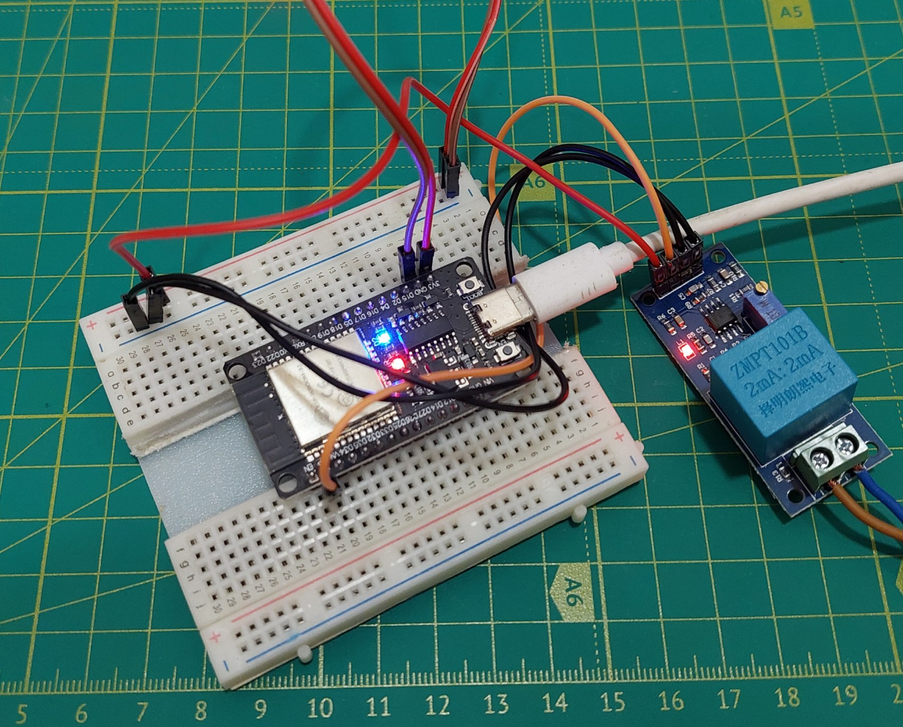

# ZMPT101B Component for ESP-IDF

This repository contains a component for interfacing with the ZMPT101B voltage sensor using ESP32 with the ESP-IDF framework.

## Overview

The ZMPT101B component enables the measurement of AC voltage using the ZMPT101B sensor and the built-in ADC and I2S peripherals of the ESP32. The component supports initialization and data reading with a median filter to eliminate voltage ripples and calculate the RMS (Root Mean Square) voltage value.



## Features

- **ADC Initialization:** Initializes the ADC for the specified channel and characterizes it using eFuse or default Vref.
- **Voltage Reading:** Reads the AC voltage from the ZMPT101B sensor and calculates the RMS value using a median filter to reduce noise.
- **Median Filter:** Filters out noise from the voltage signal using an in-place median filter that handles edge cases.
- **I2S Integration:** Uses I2S to read data samples efficiently with DMA for high-frequency sampling.

## License
This project is licensed under the MIT License. See the [LICENSE](LICENSE.txt) file for details.

## Disclaimer
This component is provided "as is", without warranty of any kind. The authors are not liable for any damages arising from the use of this component. Use it at your own risk.

## Author
Andrii Solomai

## Requirements

- **Hardware:**
  - ESP32 Development Board.
  - ZMPT101B voltage sensor module.
  - Multimeter (preferably with high accuracy) or oscilloscope for calibration.

- **Software:**
  - ESP-IDF version 4.x or higher.

1. **Clone the Repository:**

   Clone this repository into the `components` directory of your ESP-IDF project:

   ```bash
   git clone https://github.com/solomai/ESP32-ZMPT101B.git components/zmpt101b

2. **Include the Component in Your Project:**

Add the component by including zmpt101b.h in your source code.

Wiring
Connect the ZMPT101B sensor to the ESP32 as follows:

| ZMPT101B Pin | ESP32 Pin    | Description            |
|--------------|--------------|------------------------|
| VCC          | 5V or 3.3V   | Power supply           |
| GND          | GND          | Ground                 |
| OUT          | ADC channel  | Analog output to ADC   |

Ensure the ADC channel is configured correctly in your code.

## Calibration
To ensure accurate voltage readings, you must calibrate the ZMPT101B sensor:

Connect a known AC voltage source to the ZMPT101B module.
Use a multimeter or oscilloscope to measure the output voltage.
Adjust the potentiometer on the ZMPT101B module until the output voltage matches the expected value.

## Documentation

For more detailed information on the ZMPT101B sensor, refer to the following documents:

- **[ZMPT101B Board Schematic](docs/ZMPT101B%20board.pdf)**: This document provides a detailed schematic of the ZMPT101B module, including its operational amplifier circuit and connection diagram.
  
- **[ZMPT101B Specification](docs/ZMPT101B%20specification.pdf)**: This document includes detailed specifications of the ZMPT101B transformer, such as its voltage range, accuracy, and operating temperature. It also provides information on calibration and practical usage.

